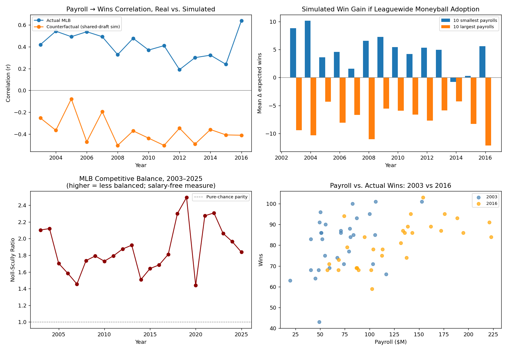

# Moneyball After Moneyball

**What if every MLB team had adopted Moneyball-style analytics starting the season after the 2002 A's?**

A counterfactual simulation of the 2003–2025 MLB landscape: real team-season and player-season data run through a from-scratch sabermetric value model and a shared-scarcity "leaguewide adoption" draft, tested against what actually happened.



## TL;DR

- Payroll predicts real-world wins (r ≈ 0.19–0.64, 2003–2016). Under the simulation, that flips to consistently *negative* — small-budget teams gain wins, big spenders lose them.
- No single "year the Moneyball edge died" shows up — the real payroll-wins correlation is too noisy across 14 seasons to pin one down.
- A simple team-level acquisition-efficiency index barely predicts *next* year's wins (r ≈ 0.01 in-sample, 0.14 out-of-sample) — teams don't seem to sustain a "smart franchise" edge year over year, at least by this measure.
- Real MLB competitive balance (2003–2025, salary-independent) got *worse*, not better, from 2018–2022 versus the mid-2000s–2010s — the opposite of the "shared knowledge levels the league" hypothesis.

## Why this only runs 2003–2016 for the payroll simulation

The only open, non-scraped MLB salary source (USA Today data bundled in the Lahman database) stops at 2016 — nobody has maintained an open replacement since. There's no reproducible way to get 2017–2025 player salaries without scraping sites like Spotrac, which this project deliberately avoids. So:

- **Payroll-constrained simulation**: 2003–2016 (14 seasons, real salary data)
- **Salary-free competitive balance analysis**: full 2003–2025 (real win/loss data only)

## Methodology

**Data**: Lahman database (Batting, Pitching, Teams, Salaries, People) through the actual 2025 season.

**Player value model** — built from raw stat lines since no external WAR source was available:
- *Batting*: linear-weights runs (1B .47 / 2B .78 / 3B 1.09 / HR 1.40 / BB,HBP .33 / out −.25) → runs above league-year average → WAR at 10 runs/win, replacement level ≈ 2 wins/600 PA below average.
- *Pitching*: FIP from HR/BB/HBP/K/IP, year-specific constant so league-average FIP = league-average ERA → runs saved → WAR the same way, replacement level ≈ 1 win/180 IP.
- Sanity check: top-ranked 2002 player is Barry Bonds at 13.7 WAR, consistent with the real-world historical consensus.

**The simulation** — a *shared-scarcity draft*, not an independent knapsack per team:
1. Pool every player-season with value and salary attached.
2. Teams draft in snake order, **ascending by real payroll** (small-budget teams pick first — modeling the idea that budget-constrained front offices are the ones pushed to get analytically creative, matching the A's origin story).
3. Each team drafts the best-remaining WAR-per-dollar player it can afford until its real payroll and real roster size run out.

An earlier version let every team independently draft from the full league pool — impossible, since a player can only play for one team. The shared draft fixes that.

## Repo structure

```
moneyball_after_moneyball_report.md   full writeup: findings + limitations
moneyball_charts.png                  4-panel summary chart
csv/
  player_value.csv                    every player-season, WAR_bat/WAR_pitch/salary
  team_panel_2003_2016_v3.csv         team-year actual vs. counterfactual wins/payroll
  yearly_summary_2003_2016.csv        payroll-wins correlations & market-size splits by year
  competitive_balance_2003_2025.csv   Noll-Scully ratio, full real-data window
  moneyball_archetypes.csv            top value/$ outlier players by year
scripts/
  build_value_model.py                Lahman stats -> player WAR + salary table
  simulate_moneyball_v3.py            shared-scarcity draft simulation, 2003-2016
  aggregate_and_extend.py             year summaries + competitive balance 2003-2025
```

## Running it

```bash
pip install pandas pyreadr numpy matplotlib
python scripts/build_value_model.py       # -> csv/player_value.csv
python scripts/simulate_moneyball_v3.py   # -> csv/team_panel_2003_2016_v3.csv
python scripts/aggregate_and_extend.py    # -> yearly summaries + balance metrics
```

Raw data: [Lahman R package](https://cdalzell.github.io/Lahman/) source (`.RData` tables converted to CSV — see `build_value_model.py`).

## Limitations (read before citing numbers)

- The value model is a simplified public-formula approximation, not Baseball-Reference or FanGraphs WAR — treat magnitudes as directional, not exact.
- The draft-order assumption (ascending payroll) drives the headline results. A different order — e.g. reverse prior-year standings, the real Rule 4 draft convention — would tell a different story and is a natural next experiment.
- No trades, injuries, aging curves, or path dependency across seasons — each year simulates independently from real starting rosters and real payrolls.
- 2017–2025 has no payroll-constrained simulation, only the salary-free balance metric.

See `moneyball_after_moneyball_report.md` for the full writeup.
